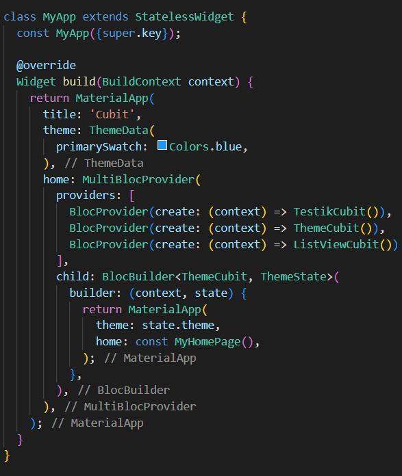

#ПРАКТИЧЕСКАЯ РАБОТА №4

##Работа с библиотекой Cubit.

<b>Цель работы:</b> Создать проект с использованием Cubit. Реализовать счетчик при нажатии на кнопку + осуществляет увеличение счетчика, при нажатии на кнопку - осуществляться уменьшение счетчика. Если текущая тема устройства светлая, то за одно нажатие должно +1 или -1. Если текущая тема устройства темная то за одно нажатие должно, +2 или -2. Каждое действие должно записываться в историю. История должна быть реализована через виджет ListView
<b>Ход работы:</b>
Для начала подключаем библиотеку для работы с Cubit.
 
 

Рисунок 21 - Библиотека для Cubit

Далее в папке lib жмем ПКМ и создаем Cubit: new Cubit, после чего создаются два файла. Один будет отвечать за логику обработки и перерисовки действий пользователя, другой будет хранить в себе состояние. Создадим по 2 файла для каждой цели (счетчик, история, тема).

Рисунок 22 - Структура проекта с Cubit

Прописываем логику приложения в Cubit файлах, которые будут слегка отличаться в зависимости от реализуемой цели.
 

Рисунок 23 - Логика Cubit

 
Рисунок 24 - Состояния для Cubit

Далее необходимо прописать логику файла main.dart, где будет хранится остальная логика для обработки cubit и смены состояний, и верстки.
Для начала оборачиваем всё приложение в MultiBlocProvider Для того, чтобы объединить несколько cubit. В случае смены темы приложения помимо MultiBlocProvider на отображаемую страницу накладывается BlocBuilder с состоянием и логикой cubit темы приложения. Благодаря BlocBuilder происходит перерисовка всех элементов верстки.
 

Рисунок 25 - main (1)

Далее пропишем кнопки, в которых с помощью context.read и определения класса кубита будем вызывать определенные методы, прописанные в классе логики cubit. После чего у нас будет происходить обновления состояния для указанного блока.

Рисунок 26 - Обработка кнопок

Далее проверяем результат работы.

Рисунок 27 - Результат работы cubit

Вывод: в ходе практической работы удалось реализовать весь требуемый функционал программы, изучить библиотеку Cubit и StateManagement, а также поработать с объектом ListView.
